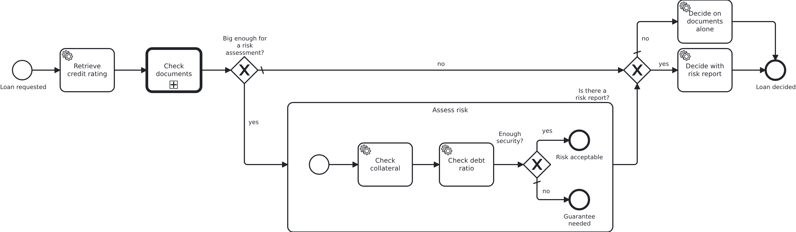
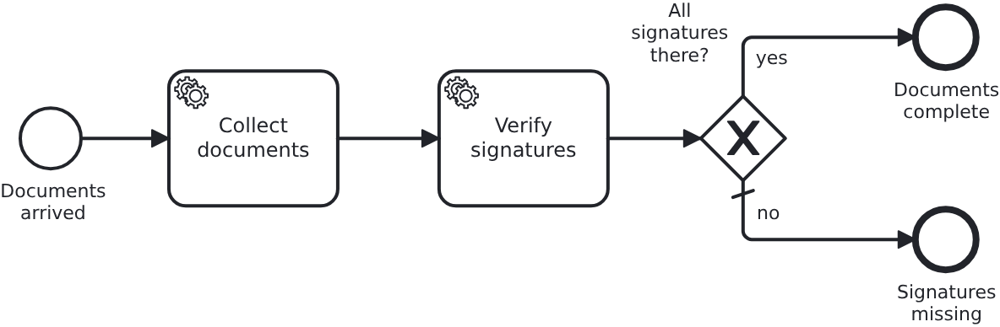

# Sections of a process and their data

[](./LICENSE)

A process which no longer fits on a screen is cut into sections, and each section usually
gets an object of its own on the workflow aggregate. That object does not exist before the
section runs, and for a section the process skips it never does. This blueprint shows how a
model asks about such a section, and what happens when it reaches into the object instead.

## What this blueprint shows





A loan approval in two sections. The document check is a call activity, so it has a model of
its own. The risk assessment is an embedded subprocess, and it runs for a big loan only. Both
shapes are normal ways to carry a section, and both are used here so that the pattern is not
tied to one of them.

Each section keeps its findings in an object of its own:

```java
@Embedded
private DocumentCheck documentCheck;

@Embedded
private RiskAssessment riskAssessment;
```

The first task of a section creates that object, the later tasks fill it in. A small loan
never enters the risk assessment, so it reaches its decision with `riskAssessment` still
empty, and it stays empty for the rest of that workflow.

### The good case

The process asks two questions after the sections, and the aggregate answers both with a
plain `boolean`:

```java
@SyncWithBPMS
public boolean isRiskAssessed() {
  return riskAssessment != null;
}

@SyncWithBPMS
public boolean isCollateralSufficient() {
  return (riskAssessment != null)
      && Boolean.TRUE.equals(riskAssessment.getCollateralSufficient());
}
```

`isRiskAssessed` is the one to copy. Whether a section ran is a fact about the workflow, the
model has every right to ask about it, and a getter on the top level of the aggregate is the
place to answer it. The gateway after the two paths reads `${riskAssessed}` and nothing else.

The type is part of the answer. A getter the model reads returns `boolean` rather than
`Boolean`, because a gateway has to take a path and every engine treats an empty value in a
condition its own way.

Inside a section it is different. There the section's object exists, because the first task of
the section made it, so the model of the section may read the section's own findings. The
document check asks `${signaturesComplete}` and the risk assessment asks
`${collateralSufficient}`, each inside itself. The getters still check for null, because one
aggregate serves every model of the workflow module and a getter which relies on where it is
called from is a getter somebody moves one day.

Such a value also stays where the section is. A called process is a process instance of its
own and keeps its own variables, so what the document check shares is gone once it ends. An
embedded subprocess shares the variables of the process instance around it, which is why the
risk assessment can answer the gateway that follows it.

### The bad case

The same gateway, written the way it suggests itself:

```xml
<bpmn:conditionExpression>${riskAssessment.collateralSufficient}</bpmn:conditionExpression>
```

For a big loan this works. For a small one the path does not resolve: `riskAssessment` is
empty, so there is nothing to read `collateralSufficient` from. VanillaBP stops the workflow
with an error naming the path and the part of it which is empty, rather than handing the
model a value nobody computed. Writing `false` instead would be worse, because a `false`
nobody computed cannot be told from one the application worked out.

Two ways lead out, and both are a decision somebody writes down:

1. Put the question on the top level of the aggregate, as `isRiskAssessed` above. The
   aggregate knows what an absent section means and the model does not have to.
2. Declare a substitute for exactly that path in the configuration of the workflow, so the
   value is stated rather than guessed.

The same mistake exists in Java, one line further in:

```java
public boolean isCollateralSufficient() {
  return riskAssessment.getCollateralSufficient();   // fails for a small loan
}
```

`LoanApprovalIT` has a test for it. It builds an aggregate which has reached no section at
all and asks every getter the model reads, which is the cheapest way to find out that one of
them forgot its null check.

## Delta to the base blueprint

Compared to [`module-single`](https://github.com/vanillabp-blueprints/module-single-springboot):

|            File            |                                         What is different                                          |
|----------------------------|----------------------------------------------------------------------------------------------------|
| `loan_approval.bpmn`       | a call activity, an embedded subprocess, and the gateway which asks whether the second section ran |
| `document_check.bpmn`      | new: the called process of the first section                                                       |
| `Aggregate.java`           | one sub-object per section, and the four boolean getters the models read                           |
| `DocumentCheck.java`       | new: the findings of the first section                                                             |
| `RiskAssessment.java`      | new: the findings of the second section, absent for a small loan                                   |
| `WorkflowTaskHandler.java` | the tasks of both sections, and `secondaryBpmnProcesses` for the called process                    |
| `Service.java`             | the business code of both sections: the first task creates the object, the later ones fill it in   |
| `loan-approval.yaml`       | the limit which makes the second section run, and the numbers the two sections use                 |
| `LoanApprovalIT.java`      | runs a loan through each path and checks that the getters answer without the skipped section       |

Both BPMN files sit in the same directory of the workflow module and are deployed together. A
called process is part of the module which owns it, not a module of its own.

## Running it

Requires a JDK 21 or newer. Camunda 7 is embedded, so nothing else has to run:

```bash
mvn install verify
```

Running it on another BPMS is a Maven profile, not one line of Java changes:

```bash
mvn install verify -Pcamunda8
```

Camunda 8 is a remote engine, so a cluster has to run. Start one; its address, and everything
else specific to that engine, lives in its profile file
`application/src/main/resources/application-camunda8.yaml`, with a copy for the module's own
test:

```yaml
vanillabp:
  adapters:
    camunda8:
      # Camunda 8 is a remote engine: point this at your cluster.
      rest-address: http://localhost:8080
```

That file is loaded because the Maven profile `camunda8` sets the Spring profile of the same
name, so the engine is chosen once, on the Maven command line, and the build, the tests and
`spring-boot:run` all follow it.

Start the application:

```bash
mvn -pl application spring-boot:run
```

This is the URL that starts a loan approval:

```
http://localhost:8080/api/loan-approval/start?amount=5000
```

5000 is below the configured limit, so the risk assessment is skipped and the log shows a
workflow which decides without it:

```
Loan approval '4d0e…' started
Credit rating of loan approval '4d0e…' is 50, risk assessment not required
Loan approval '4d0e…' received 3 of 3 documents
Signatures of loan approval '4d0e…' are complete
Loan approval '4d0e…' was approved on its documents, without a risk report
```

An amount of 30000 is above the limit, so the second section runs and writes its object:

```
Credit rating of loan approval '92a5…' is 100, risk assessment required
Loan approval '92a5…' received 3 of 4 documents
Signatures of loan approval '92a5…' are incomplete
Collateral of loan approval '92a5…' is worth 12000, needed are 15000
Debt ratio of loan approval '92a5…' is 60%
Loan approval '92a5…' was rejected (collateral 12000, debt ratio 60%)
```

The result of a run is at

```
http://localhost:8080/api/loan-approval/{loanRequestId}
```

For a small loan the risk assessment is missing from that answer, which is the state the whole
blueprint is about. All the numbers the two sections use are in the module's own configuration
(`loan-approval/src/main/resources/loan-approval/loan-approval.yaml`).

Nothing about identifiers shows up at startup: the BPMS profiles of this blueprint set
`name-clash-avoidance: use-prefix`, so VanillaBP puts the workflow module ID in front of every
identifier before it reaches the engine and takes it off again on the way back. The BPMN files,
the business code and the rest of the configuration keep the plain names, and no tenant is
involved, which matters on a BPMS licensed per tenant. What the modes are and what each of them
costs is in
[the wiki](https://github.com/vanillabp/adapter-platform-integration/wiki/Workflow-modules#how-name-clashes-are-avoided).

While the application runs on Camunda 7, Camunda's own web applications are served at

```
http://localhost:8080/camunda
```

Log in with `demo` / `demo`. Cockpit shows the two shapes side by side: the call activity has
a process instance of its own, and the embedded subprocess is a box inside the loan approval.
The user comes from `application/src/main/resources/application-camunda7.yaml` and exists so
that the blueprint can be operated without setting one up; an application with an identity
provider of its own leaves that section out.

The Camunda 8 profile brings neither the dependency nor those settings into effect. Its
tooling is part of the cluster, and the file naming a Camunda 7 adapter id is simply not
loaded there. Naming an adapter id whose adapter is not on the classpath is a configuration
error VanillaBP refuses to start with, and the profiles are what keeps that from happening.

## How it works

|                                            File                                             |                                     Role                                     |
|---------------------------------------------------------------------------------------------|------------------------------------------------------------------------------|
| `loan-approval/src/main/resources/loan-approval/processes/<adapter-id>/loan_approval.bpmn`  | the two sections and the gateway asking whether the second one ran           |
| `loan-approval/src/main/resources/loan-approval/processes/<adapter-id>/document_check.bpmn` | the called process of the first section                                      |
| `.../loanapproval/model/Aggregate.java`                                                     | one sub-object per section, and the boolean getters the models read          |
| `.../loanapproval/model/DocumentCheck.java`                                                 | what the first section found                                                 |
| `.../loanapproval/model/RiskAssessment.java`                                                | what the second section found, absent when it did not run                    |
| `.../loanapproval/Service.java`                                                             | the business code: the first task of a section creates that section's object |
| `.../loanapproval/WorkflowTaskHandler.java`                                                 | the tasks of both sections, wired by one `@WorkflowService`                  |
| `loan-approval/src/test/.../LoanApprovalIT.java`                                            | one run per path, plus the getters asked on an aggregate without any section |

The order of events for a big loan: the rating task answers the two questions the gateways
ask, the call activity runs the document check, the gateway sends the loan into the embedded
subprocess, the two tasks there build the risk assessment, and the gateway after it reads
`${riskAssessed}` and picks the decision task which uses the risk report. A small loan takes
the short way around the subprocess and lands on the other decision task.

The sub-objects are embedded rather than tables of their own. That is what makes one of them
absent: all of its columns are empty for a workflow which skipped the section, and an embedded
object whose columns are all empty comes back as nothing. A section object stored in a table
of its own behaves the same way, and so does a document with a missing field.

Nothing of the two sections reaches the BPMS. `Aggregate` carries `@NoSyncWithBPMS` and the
four getters the models read carry `@SyncWithBPMS`, so the engine holds four booleans and the
aggregate's ID. The numbers behind them stay in the application, which is also why their types
are a question of the data model alone.

## Documentation

- [Workflow aggregates](https://github.com/vanillabp/adapter-platform-integration/wiki/Workflow-aggregates): one aggregate per business case, and the getters a model reads
- [Sharing workflow-aggregate data](https://github.com/vanillabp/adapter-platform-integration/wiki/Workflow-aggregates#fine-grained-control-over-attributes-synchronized-to-the-bpms): `@SyncWithBPMS`, `@NoSyncWithBPMS`, and what a BPMS gets to see
- [Call activities](https://github.com/vanillabp/spi-for-java#call-activities): when a section becomes a process of its own
- [Wire up a process](https://github.com/vanillabp/spi-for-java#wire-up-a-process): `@WorkflowService`, `@BpmnProcess` and what `secondaryBpmnProcesses` is for
- the wiki of the [BPMS adapter](https://github.com/vanillabp/adapter-platform-integration/wiki/BPMS-adapters) you use: how that engine scopes the variables of a section

This blueprint is developed in the monorepo
[`blueprints`](https://github.com/vanillabp-blueprints/blueprints). This repository is a
read-only mirror, **issues and pull requests belong there.**

## Noteworthy & Contributors

[VanillaBP](https://www.github.com/vanillabp/spi-for-java) was developed by [Phactum](https://www.phactum.at) with the
intention of giving back to the community as it has benefited the community in the past.


## License

Copyright 2026 Phactum Softwareentwicklung GmbH

Licensed under the Apache License, Version 2.0
