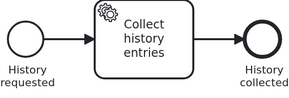

# Workflow aggregates without a repository

[](./LICENSE)

VanillaBP loads and saves the workflow aggregate on the application's behalf, so it has to
know how that is done. Usually a repository answers that question. This blueprint removes the
repository twice over: it has two use cases, one aggregate is a JPA entity storing itself, the
other a MongoDB document storing itself, and both live in the same workflow module. A delta on
top of `module-single`.

The interesting part of this blueprint is what is not in it. Nothing configures the
persistence, nothing is injected to reach it, and nothing says which of the two databases an
aggregate belongs to.

## What this blueprint shows




Two use cases, each the process of the base blueprint: one service task, started through a GET
request, and an aggregate the task fills. The processes are not the point here, the way their
aggregates are stored is, and they are deliberately the same so that the difference is visible.

The loan approval extends `PanacheEntityBase` and lives in a relational database:

```java
@Entity
@Table(name = "LOAN_APPROVAL")
public class Aggregate extends PanacheEntityBase {

  @Id
  private String loanRequestId;
  ...
}
```

The credit history extends `PanacheMongoEntityBase` and lives in MongoDB:

```java
@MongoEntity(collection = "CREDIT_HISTORY")
public class Aggregate extends PanacheMongoEntityBase {

  @BsonId
  private String creditHistoryId;
  ...
}
```

No repository, no `AggregatePersistenceAware`, no property naming either of them. VanillaBP
asks each aggregate which idiom it is written in while the application is built, and says what
it found, one line per aggregate:

```
Using VanillaBP's Hibernate ORM Panache active record persistence for workflow aggregate
'blueprint.workflowmodule.loanapproval.model.Aggregate'
Using VanillaBP's MongoDB Panache active record persistence for workflow aggregate
'blueprint.workflowmodule.credithistory.model.Aggregate'
```

That the two lines differ is the claim of this blueprint. **The idiom is resolved per aggregate,
not per application**, so an application may mix them, and the resolution order applies to each
aggregate on its own: an `AggregatePersistenceAware` written by the application wins over
everything, a repository for that aggregate wins over the active record, and Spring Data
repositories answer last. Adding a repository for one of these aggregates later moves that one
onto it without a word of configuration and leaves the other where it is. The log line is how
you see which way it went, and if it names a repository you thought you had deleted, that is the
answer to why nothing changed.

**The price, and where it is paid.** A repository is a bean, so it is a place where things can
be declared, a transaction most of all. Without it the application reads through the static
finder of the aggregate, and that needs a transaction or an active request context of its own:

- `Service#getLoanApproval` and `Service#getCreditHistory` carry `@Transactional`, as they do in
  the base blueprint. Here it is not a formality but the only place left where the transaction
  can be declared.
- the integration tests read in a transaction of their own per poll, which is what the shared
  test harness does anyway. Without it, the finder would have nothing to read from.

Nothing changes for the `@WorkflowTask` methods. VanillaBP owns the transaction of a task,
loads the aggregate before the method and saves it afterwards, so a handler declaring a
transaction is as wrong here as everywhere else, and VanillaBP still fails the boot over it.

**Two databases, and what VanillaBP does with them.** Three things need storage: the workflow
aggregate, the phase-two outbox and the log of delivered tasks. The aggregate is where the
application put it. The other two belong into the transaction which persists that aggregate,
otherwise a rollback leaves an outbox entry for a workflow whose aggregate never existed.

In an application with two databases both defaults are active, the relational one and the
MongoDB one, and VanillaBP attributes them the same way it resolved the persistence: the loan
approval's entries go into the relational store, the credit history's into MongoDB. There is
nothing to configure, and the way to overrule it is a `PhaseTwoOutboxAware` or a
`TaskDeliveryLogAware` bean, which this blueprint has no reason to have.

**MongoDB writes in a transaction, and that needs a replica set.** MongoDB Panache enlists its
session in the transaction VanillaBP opens, so aggregate, outbox entry and delivery record commit
together, and a MongoDB transaction is only available on a replica set or a sharded cluster.
The dev services start a single-node replica set, so a test needs nothing; a production
deployment has to be one, and VanillaBP probes for it while starting and warns if it is not.

**With a MongoDB aggregate an embedded engine is a remote engine, as far as consistency goes.**
The embedded Camunda 7 stores its own state in the relational database, and no transaction spans
both databases. What holds the two together is the same mechanism a remote engine needs: VanillaBP
starts every workflow in two phases, the local transaction stores the aggregate and the intent,
and the engine is called afterwards. So do not read "embedded" as "one commit" here. For the
credit history the engine's state and the aggregate are two commits, and the outbox is what makes
that reliable rather than lucky.

## Delta to the base blueprint

Compared to [`module-single`](https://github.com/vanillabp-blueprints/module-single-quarkus):

|                       File                        |                                             What is different                                             |
|---------------------------------------------------|-----------------------------------------------------------------------------------------------------------|
| `.../loanapproval/model/AggregateRepository.java` | deleted. There is no repository, and nothing replaces it                                                  |
| `.../loanapproval/model/Aggregate.java`           | extends `PanacheEntityBase` and carries the one finder the application needs, `byId`                      |
| `.../loanapproval/Service.java`                   | injects no repository; the reading method calls `Aggregate.byId` inside its own transaction               |
| `.../credithistory/`                              | the second use case, the same four classes, with an aggregate extending `PanacheMongoEntityBase`          |
| `loan-approval/pom.xml`                           | both Panache flavours, because the module has an aggregate of each                                        |
| `application/src/main/resources/application.yaml` | a MongoDB database next to the data source, and no connection string, so the dev services run one         |
| `loan-approval/src/test/.../*IT.java`             | read through the aggregates' own finders, and assert that a workflow started remotely keeps its aggregate |

Everything else is the base blueprint, file for file: the wiring classes, the API, the module's
own configuration, the test harness.

## Running it

Requires a JDK 21 and a running Docker, because the dev services start a MongoDB for the second
use case. Camunda 7 is embedded, so nothing else has to run:

```bash
mvn install verify
```

That is not the whole story for this blueprint, though. Both use cases assert that a workflow
started on a remote engine keeps its aggregate, and that only means something there:

```bash
mvn install verify -Pcamunda8
```

Camunda 8 is a remote engine, so a cluster has to run. Start one; its address, and everything
else specific to that engine, lives in its profile file
`application/src/main/resources/application-camunda8.yaml`, with a copy for the module's own
test:

```yaml
vanillabp:
  adapters:
    camunda8:
      # Camunda 8 is a remote engine: point this at your cluster.
      rest-address: http://localhost:8080
```

That file is loaded because the Maven profile `camunda8` makes the config profile of the same
name the parent of whichever profile the application runs in, so the engine is chosen once, on
the Maven command line, and the build, the tests and `quarkus:dev` all follow it.

Start the application:

```bash
mvn -pl application quarkus:dev
```

Nothing about identifiers shows up at startup: the BPMS profiles of this blueprint set
`name-clash-avoidance: use-prefix`, so VanillaBP puts the workflow module ID in front of every
identifier before it reaches the engine and takes it off again on the way back. The BPMN files,
the business code and the rest of the configuration keep the plain names, and no tenant is
involved, which matters on a BPMS licensed per tenant. What the modes are and what each of them
costs is in
[the wiki](https://github.com/vanillabp/adapter-platform-integration/wiki/Workflow-modules#how-name-clashes-are-avoided).

Building the application is where the two lines about the persistence appear, so they show up in
that command as well as in `mvn install`.

Start a loan approval and a credit history. These are the only URLs you need:

```
http://localhost:8080/api/loan-approval/start?amount=5000
http://localhost:8080/api/credit-history/start?years=3
```

Each answers with the ID of the case it started and logs the URL showing the result:

```
Loan approval '0f7c…' started
Credit rating of loan approval '0f7c…' is 50
Show the result -> http://localhost:8080/api/loan-approval/0f7c…
```

Opening that URL reads the aggregate through its own finder and shows what the service task
wrote. The two URLs behave identically, and the databases behind them do not.

## How it works

|                                     File                                     |                                             Role                                             |
|------------------------------------------------------------------------------|----------------------------------------------------------------------------------------------|
| `.../loanapproval/model/Aggregate.java`                                      | the JPA entity which is also its own persistence, plus the finder `byId`                     |
| `.../credithistory/model/Aggregate.java`                                     | the MongoDB document which is also its own persistence, plus the finder `byId`               |
| `.../loanapproval/Service.java`, `.../credithistory/Service.java`            | the business code; the reading methods own the transaction the finders need                  |
| `.../<usecase>/Workflow.java`                                                | what the application tells the process; the only class using `ProcessService`                |
| `.../<usecase>/WorkflowTaskHandler.java`                                     | what the process tells the application: `@WorkflowService`, `@WorkflowTask`, calls `Service` |
| `.../<usecase>/ApiController.java`                                           | the GET endpoints operating the process                                                      |
| `loan-approval/src/main/resources/loan-approval/processes/camunda7/*.bpmn`   | the two processes: start event, service task, end event                                      |
| `loan-approval/src/test/.../LoanApprovalIT.java`, `.../CreditHistoryIT.java` | start real workflows, read the aggregates statically, and cover the remote start             |
| `loan-approval/src/test/.../WorkflowModuleTest.java`                         | the base class they inherit from: a fresh transaction per poll, identical in every blueprint |
| `application/src/main/resources/application.yaml`                            | the two databases, and nothing about the workflows or their persistence                      |

What happens when a loan is requested is the same as in the base blueprint, except for who
touches the database. `Service#initiateLoanApproval` builds the aggregate and tells `Workflow`
that a loan was requested; `ProcessService#startWorkflow` saves the aggregate through Panache's
operations rather than through a repository, and starts the workflow in the same transaction.
When the BPMS reaches the service task, VanillaBP loads the aggregate, calls
`WorkflowTaskHandler#retrieveCreditRating`, and saves it again, all inside the transaction it
owns for that task. The credit history does the same, and the only difference is which database
its transaction reaches.

There is no class of the application involved in any of that, which is the point and also the
limit of the idiom: everything the application itself wants to read has to bring a transaction
along. Four places do, and they are the four places which read.

An active record is an ordinary aggregate in every other respect, including the way two
branches of one workflow can overwrite each other's writes. That is
[`persistence-parallel-branches`](https://github.com/vanillabp-blueprints/persistence-parallel-branches-quarkus)
and [the wiki](https://github.com/vanillabp/adapter-platform-integration/wiki/Workflow-aggregates#two-writers-on-one-aggregate),
not repeated here. The MongoDB repository idiom, and what an application looks like which has no
relational database at all, is
[`persistence-mongodb`](https://github.com/vanillabp-blueprints/persistence-mongodb-quarkus).

## Documentation

- [Persisting workflow aggregates](https://github.com/vanillabp/adapter-platform-integration/wiki/Quarkus-integration#persisting-workflow-aggregates): the idioms recognised, the order they are resolved in, and what ends the build instead
- [Workflow aggregates](https://github.com/vanillabp/adapter-platform-integration/wiki/Workflow-aggregates): why there are no process variables, and what an aggregate is for
- [Two writers on one aggregate](https://github.com/vanillabp/adapter-platform-integration/wiki/Workflow-aggregates#two-writers-on-one-aggregate): the collision an active record has as well, and the four ways to deal with it
- [Workflow modules](https://github.com/vanillabp/adapter-platform-integration/wiki/Workflow-modules): what a workflow module is, its ID, and where its BPMN files are looked for
- [Wire up a process / Wire up a task](https://github.com/vanillabp/spi-for-java#usage): the annotations used in `WorkflowTaskHandler.java`
- the wiki of the [BPMS adapter](https://github.com/vanillabp/adapter-platform-integration/wiki/BPMS-adapters) you use: how a BPMN task has to be modelled for that engine

This blueprint is developed in the monorepo
[`blueprints`](https://github.com/vanillabp-blueprints/blueprints). This repository is a
read-only mirror, **issues and pull requests belong there.**

## Noteworthy & Contributors

[VanillaBP](https://www.github.com/vanillabp/spi-for-java) was developed by [Phactum](https://www.phactum.at) with the
intention of giving back to the community as it has benefited the community in the past.


## License

Copyright 2026 Phactum Softwareentwicklung GmbH

Licensed under the Apache License, Version 2.0

        https://www.apache.org/licenses/LICENSE-2.0

Unless required by applicable law or agreed to in writing, software distributed under the
License is distributed on an "AS IS" BASIS, WITHOUT WARRANTIES OR CONDITIONS OF ANY KIND,
either express or implied. See the License for the specific language governing permissions
and limitations under the License.
