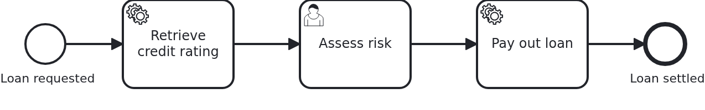

# A workflow aggregate which remembers every change

[](./LICENSE)

Banks and insurers have to be able to say later who changed a case, when, and what it looked
like before. The workflow aggregate is the right place for that, because it carries the case.

VanillaBP asks nothing of you here and hands you nothing: auditing belongs to the
application, and it stays that way. What VanillaBP does have is the seam. An entry which
reports something to another system is written inside the transaction of the event and sent
afterwards, so by the time it is sent the case has moved on. Such an entry may say which
state it means, and the application is the one which knows how to name a state and how to
read it back.

This blueprint fills that seam with Hibernate Envers.

## What this blueprint shows



The loan approval of the base blueprint with three moments in it, which is what makes the
difference visible. A service task writes the credit rating, a person decides whether the
risk is acceptable, and a service task after that pays the loan out. Each of the three
writes the workflow aggregate, so each of them is one state of the case.

Two things happen on top of that. Every change is recorded by Hibernate Envers, and the
decision is reported to a compliance archive. The report is written down when the decision
is taken and sent afterwards, and the archive is away at the first attempt, so the payout
is booked in between. What the archive is handed in the end is the loan approval as it was
at the decision rather than as it is by then.

### What the auditing writes

One word on the aggregate, `@Audited`, and Hibernate Envers keeps three tables instead of
one:

|          Table           |                                What is in it                                |
|--------------------------|-----------------------------------------------------------------------------|
| `LOAN_APPROVAL`          | the loan approval as it is now, the table every blueprint has               |
| `LOAN_APPROVAL_AUD`      | one row per change, with the number of the change and what kind it was      |
| `LOAN_APPROVAL_REVISION` | one row per change, with the moment it happened and the person it came from |

The last table is the revision entity of this application, `AuditedChange`. Without one,
Envers writes a table of its own called `REVINFO` which knows the number and the moment and
nothing else. Adding a class and a listener is what gets the name of the person in, and that
name is usually the reason an auditing is bought at all.

Reading it is a repository call. `AggregateRepository` extends `RevisionRepository` of
Spring Data Envers, so `findRevisions(loanRequestId)` answers the whole trail, and the API of
this blueprint shows it:

```
#1 by the customer: Aggregate(loanRequestId=0f7c…, amount=5000, creditRating=null, …)
#2 by the process: Aggregate(…, creditRating=50, assessRiskTaskId=null, …)
#3 by the process: Aggregate(…, creditRating=50, assessRiskTaskId=22, …)
#4 by paula: Aggregate(…, riskAcceptable=true, decidedBy=paula, paidOut=null)
#5 by the process: Aggregate(…, riskAcceptable=true, decidedBy=paula, paidOut=true)
```

Five changes for three business steps, and the third one is the reason: the application
keeps the id of the open user task on the aggregate, which is a write like any other. An
auditing records what the data does, not what the process means.

### This is Envers, not the auditing of Spring Data

The names are close enough to cause a wrong decision. Spring Data's auditing, `@CreatedDate`
and `@LastModifiedDate` with `@EnableJpaAuditing`, writes who touched a record last and when
they did. It keeps no old state, so it can never answer what the case looked like at an
earlier moment. Hibernate Envers keeps the old states, and that is what this blueprint is
about.

### Naming a state before it exists

This is the part worth reading before copying anything.

A report about an event is written down while the event happens and sent later, so it has
to name the state it means. Envers numbers a change when the transaction commits, which is
after the report was written, so the number is of no use there.

The way out is an id of the application's own. `ChangeBeingMade` makes one up as soon as
somebody asks, the revision of that transaction is written with that id in it, and reading
a state back is two steps: look up the revision carrying the id, then ask Envers for the
loan approval at that revision.

```java
// while the transaction is open, in AuditedAggregatePersistence
return ChangeBeingMade.id();

// later, when the report is sent
final var revisions = entityManager
    .createQuery("select change.id from AuditedChange change where change.changeId = :changeId", Integer.class)
    .setParameter("changeId", auditingId)
    .getResultList();
```

The id belongs to the transaction, not to a single write, and that is what makes it
usable: a transaction which flushes twice still names one state. An id of a transaction
which rolled back is never referenced by anything, because whatever wrote it down rolled
back with it.

Two other ways do not survive a second look, and both are worth knowing about:

- `AuditReader#getCurrentRevision(..., true)` creates the revision row early and hands out
  its number. It is deprecated, since Envers 5.2, and the replacement it points at,
  a `RevisionListener`, runs while the transaction commits, which is exactly too late. A
  blueprint is copied, so it carries nothing which the next upgrade of a dependency can
  take away.
- The `@Version` attribute of an application which uses optimistic locking names a state
  as well, and it costs nothing extra. It is assigned per write though: a transaction which
  writes the aggregate twice ends with a version its audit row does not carry, and the
  report then finds nothing. Take it where a transaction writes once, which you have to be
  sure of.

### Who made the change

Envers builds the revision entity itself, without asking the bean container, so the name of
the person cannot be injected into the listener. It travels on the thread: `ChangeBeingMade`
holds it, the API binds it around the call, and the listener reads it when Envers writes the
revision.

Where that binding sits matters. Envers writes the revision when the transaction commits,
which is after the business method returned, so a name taken back inside the business method
comes too late and the change ends up unattributed. The API is the right place, and an
application with a security framework reads the authenticated user in a filter, which spans
the same stretch.

Changes nobody announced come from the process: a service task runs on a thread of the BPMS,
where there is no person to name.

### What the report shows, and what it cannot

The report is written down in the transaction of the decision, so a decision which rolls
back takes its report with it, and it is sent once that transaction committed. It names
the state of the decision, so its delivery reads the loan approval as it was then, however
long the delivery took.

VanillaBP carries the report and the id with it. Which of the two states an entry wants is
the entry's own business: everything VanillaBP writes back into the BPMS reads the state of
the moment it is written, because the BPMS is where the case goes on, and a value which is
a day old would be wrong there.

Limits belong to the picture as well:

- The state may be gone. An auditing is cleaned up at some point, and an entry may wait
  longer than that. The load then answers nothing, VanillaBP reads the current state instead
  and writes a warning naming the aggregate and the state it wanted. A report with newer
  values beats no report.
- Only what is in the aggregate is audited. What an adapter reads out of the BPMS while it
  dispatches, the assignee of a user task, its candidates, its due date, is the state of that
  moment. It is the data of the BPMS, and the BPMS keeps no history of it anybody could ask.
- MongoDB has nothing of this built in. An application storing its aggregates there writes
  the versions itself or does without them, and the two methods of the seam are the same two
  either way.

Auditing is not free. Every change costs a second write and a row which is never deleted, so
it is switched on where somebody has to answer for the case later and left off everywhere
else.

## Delta to the base blueprint

Compared to [`module-single`](https://github.com/vanillabp-blueprints/module-single-springboot):

|                   File                   |                                            What is different                                             |
|------------------------------------------|----------------------------------------------------------------------------------------------------------|
| `loan_approval.bpmn`                     | a decision by a person between the credit rating and the payout, so the aggregate is written three times |
| `model/Aggregate.java`                   | carries `@Audited`, and the attributes the three steps write                                             |
| `model/AggregateRepository.java`         | also a `RevisionRepository`, which reads the trail                                                       |
| `config/AuditedRepositories.java`        | switches on the repository factory that reads revisions                                                  |
| `audit/AuditedChange.java`               | the revision entity, so a change knows who made it                                                       |
| `audit/ChangeBeingMade.java`             | the id naming the change, the person making it, and how long each of them has to be there                |
| `audit/AuditedAggregatePersistence.java` | the seam: the state of now, and the aggregate as it was                                                  |
| `audit/ComplianceNotices.java`           | the report about the decision, which asks to be given the state of that moment                           |
| `ComplianceArchive.java`                 | the port to the archive, so a test can put a simulator in its place                                      |
| `LoanApprovalIT.java`                    | decides, waits for the payout, and asserts on what the archive was told                                  |

## Running it

Requires a JDK 21. Camunda 7 is embedded, so nothing else has to run:

```bash
mvn install verify
```

Running it on another BPMS is a Maven profile, not one line of Java changes:

```bash
mvn install verify -Pcamunda8
```

Camunda 8 is a remote engine, so a cluster has to run. Start one; its address, and everything
else specific to that engine, lives in its profile file
`application/src/main/resources/application-camunda8.yaml`, with a copy for the module's own
test:

```yaml
vanillabp:
  adapters:
    camunda8:
      # Camunda 8 is a remote engine: point this at your cluster.
      rest-address: http://localhost:8080
```

That file is loaded because the Maven profile `camunda8` sets the profile of the same name,
so the engine is chosen once, on the Maven command line, and the build, the tests and
`spring-boot:run` all follow it.

Start the application:

```bash
mvn -pl application spring-boot:run
```

Start a loan approval. This is the only URL you need:

```
http://localhost:8080/api/loan-approval/start?amount=5000&requestedBy=the%20customer
```

It answers with the id of the loan request, and the log shows where the process stops:

```
Loan approval '0f7c…' was requested by the customer
Credit rating of loan approval '0f7c…' is 50
Loan approval '0f7c…' waits for a risk assessment. Continue with one of:
  Acceptable -> http://localhost:8080/api/loan-approval/0f7c…/assess-risk/1f2e…?riskIsAcceptable=true&decidedBy=paula
  Too risky  -> http://localhost:8080/api/loan-approval/0f7c…/assess-risk/1f2e…?riskIsAcceptable=false&decidedBy=paula
```

Open one of them, and the log shows the point of the whole blueprint:

```
Risk of loan approval '0f7c…' was assessed by paula as acceptable
The compliance archive does not answer about loan approval '0f7c…'. VanillaBP keeps the notice and tries again.
Loan approval '0f7c…' was paid out
The compliance archive recorded 'risk-assessed' of loan approval '0f7c…': Aggregate(…, riskAcceptable=true, decidedBy=paula, paidOut=null)
```

The archive is handed the loan approval without the payout, although the payout was booked
before the notice went out. The refusal at the first attempt is arranged, in
`LocalComplianceArchive`, so the wait happens on the first run instead of on the first bad
day.

Two URLs show the two answers side by side, the case as it is and the trail of everything it
was:

```
http://localhost:8080/api/loan-approval/0f7c…
http://localhost:8080/api/loan-approval/0f7c…/trail
```

While the application runs on Camunda 7, Camunda's own web applications are served at

```
http://localhost:8080/camunda
```

Log in with `demo` / `demo`. The user comes from
`application/src/main/resources/application-camunda7.yaml` and exists so that the blueprint
can be operated without setting one up; an application with an identity provider of its own
leaves that section out.

## How it works

|                                          File                                          |                                              Role                                              |
|----------------------------------------------------------------------------------------|------------------------------------------------------------------------------------------------|
| `loan-approval/src/main/resources/loan-approval/processes/camunda7/loan_approval.bpmn` | the process: rating, decision, payout, and therefore three states of the case                  |
| `.../loanapproval/model/Aggregate.java`                                                | the workflow aggregate, audited by one annotation                                              |
| `.../loanapproval/model/AggregateRepository.java`                                      | the repository, and the revisions of Spring Data Envers                                        |
| `.../loanapproval/config/AuditedRepositories.java`                                     | the factory a revision repository needs, declared by the module itself                         |
| `.../loanapproval/audit/AuditedChange.java`                                            | the revision entity: number, moment, and who made the change                                   |
| `.../loanapproval/audit/ChangeBeingMade.java`                                          | the id of the change and the person making it, and the listener writing both into the revision |
| `.../loanapproval/audit/AuditedAggregatePersistence.java`                              | what VanillaBP asks: the state of now, and the aggregate as it was at a state                  |
| `.../loanapproval/audit/ComplianceNotices.java`                                        | the report: written in the transaction of the decision, sent afterwards, about that state      |
| `.../loanapproval/ComplianceArchive.java`                                              | the port to the archive; `LocalComplianceArchive` is the stand-in to replace                   |
| `.../loanapproval/Service.java`                                                        | the business code, which knows nothing about revisions                                         |
| `.../loanapproval/ApiController.java`                                                  | the GET endpoints, and the one place saying who is acting                                      |
| `loan-approval/src/test/.../ComplianceArchiveSimulator.java`                           | the archive in the test, away at the first attempt                                             |
| `loan-approval/src/test/.../LoanApprovalIT.java`                                       | plays the case through and asserts what the archive was told                                   |

The test is the proof. It starts a loan approval, answers the risk assessment as `paula`,
waits until the payout was booked, and only then looks at what the archive received. The
notice carries the decision and no payout, while the aggregate in the database carries both,
and the archive was asked twice because the first attempt was turned down. The second test
reads the trail and checks that every change names its author. The third one measures the
early revision on its own: it asks for the revision inside a transaction, changes the loan
approval afterwards, and reads that revision back once the transaction committed. What comes
back is the changed state, which is what says that the number handed out before the flush is
the number the change was recorded under.

An application which keeps no auditing at all is unaffected by any of this. Both methods of
the seam have defaults, and both defaults are what VanillaBP did before they existed: no
state is named, and every load reads the current one.

## Documentation

- [Workflow aggregates](https://github.com/vanillabp/adapter-platform-integration/wiki/Workflow-aggregates): what an aggregate is, and why there are no process variables
- [Aggregate persistence](https://github.com/vanillabp/adapter-platform-integration/wiki/Workflow-aggregates#aggregate-persistence): the interface this blueprint implements, and when an application needs to
- [What the outbox guarantees](https://github.com/vanillabp/adapter-platform-integration/wiki/Spring-Boot-integration#what-the-outbox-guarantees): why a report is written first and sent afterwards, and what that costs
- [Workflow modules](https://github.com/vanillabp/adapter-platform-integration/wiki/Workflow-modules): what a workflow module is, its ID, and where its BPMN files are looked for
- [Wire up a process / Wire up a task](https://github.com/vanillabp/spi-for-java#usage): the annotations used in `WorkflowTaskHandler.java`
- [Hibernate Envers](https://docs.jboss.org/hibernate/orm/current/userguide/html_single/Hibernate_User_Guide.html#envers): the auditing itself, its tables and its queries
- [Spring Data Envers](https://docs.spring.io/spring-data/envers/reference/): the repository reading the revisions
- the wiki of the [BPMS adapter](https://github.com/vanillabp/adapter-platform-integration/wiki/BPMS-adapters) you use: how a BPMN task has to be modelled for that engine

This blueprint is developed in the monorepo
[`blueprints`](https://github.com/vanillabp-blueprints/blueprints). This repository is a
read-only mirror, **issues and pull requests belong there.**

## Noteworthy & Contributors

[VanillaBP](https://www.github.com/vanillabp/spi-for-java) was developed by [Phactum](https://www.phactum.at) with the
intention of giving back to the community as it has benefited the community in the past.


## License

Copyright 2026 Phactum Softwareentwicklung GmbH

Licensed under the Apache License, Version 2.0
